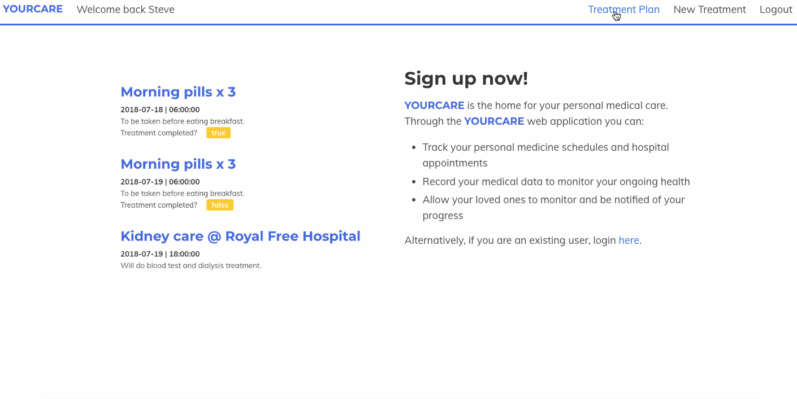
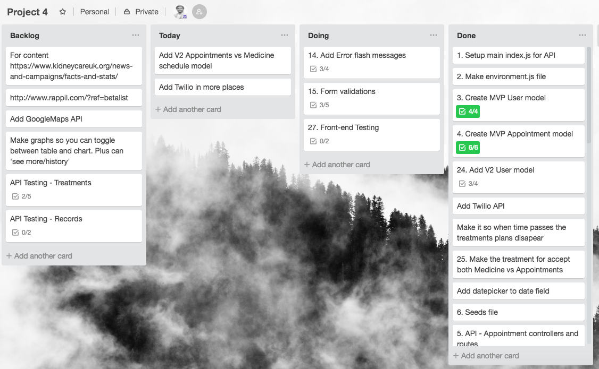
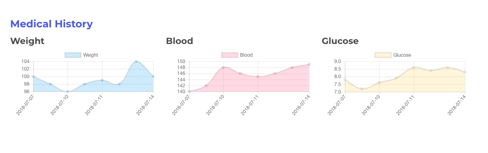

# GA WDI Project Four - YourCare

This was the fourth project assignment during my time on General Assembly's Web Development Immersive Course (week 10-11). I built a product for people in long term medical care. The app allows users to:
* Track their upcoming medical appointments and medicine schedules.
* Track their personal medical data and display it graphically.
* Grant access to their family members to view their treatments and upcoming care.
* Build various notifications around appointments (reminders, missed appointments, and so on).



##### [Visit the website](https://yourcare.herokuapp.com/) to check it out.

## Brief
Design and build a MERN stack app (MongoDB, Express, React, Node.js) with:
* At least two models.
* A persistent database (with all CRUD actions on records).
* Your own API on the back-end.
* User authentification (registration and session creation).
* RESTful routes.
* An external-API.
* React on the front-end.
* A CSS framework on the front-end.
* Deployed on Heroku.

Given my future interest in entrepreneurship, I also gave myself two extra criteria to meet:
* I wanted my idea to be as original as possible, with real word application.
* I wanted it to have some commercial value. Would a user potentially pay for it?

## Build Process

### Inspiration
In order to gain inspiration for my web app I:
* Listed my areas of interest and brainstormed how to build useful apps.
* Listed communities I am part of and thought of what I could build to serve them.
* Looked at sites like [IndieHackers](https://www.indiehackers.com/), [ProductHunt](https://www.producthunt.com/) and [BetaList](https://betalist.com/) to see other interesting tools and products.

### Plan
With 3 projects already completed ([one](https://github.com/stevanpopo/ga-wdi-project-one), [two](https://github.com/stevanpopo/ga-wdi-project-two), [three](https://github.com/stevanpopo/ga-wdi-project-three)) I was feeling more confident in my ability to plan well. Using Trello I:
* Created a list of all the features I wanted to create.
* Split the list by component parts of the app.
* Organized the list by which elements were crucial for MVP (phase one features) and which could be added in later (phase two features).
* Began to think about how to create those features, making checklists of what individual pieces would be needed for it to work and if there were dependencies on other parts of the app.
* Tried to make sure each point on the plan was small enough that it could be solved independently (or googled easily).

### Build
The build phase involved simply getting in front of my computer and tackling each element of the plan one by one, with a focus on getting to MVP as quickly as possible. It felt very satisfying to tick these off and mark them as done (in green).



### MVP
As with previous projects, getting to MVP nice and early was a crucial step in the development process. In order to do this I made some assumptions and simplifications for the first part of the project:
1. Initially, I didn't include the medical record model. First priority was to have a functioning restful app for treatments.
2. For the treatments, I initially assumed only one type of treatment (a one-off appointment, leaving out medicine schedules which would involve the added complication of repeat treatments.)

### Learnings and Highlights
* **Manipulating data for front-end display** - This project I got to grips with manipulating data as it is saved in the db, in order to effect the presentation of it on the front-end. Below is an example that allows me to demonstrate a today, tomorrow, x days out feature on the front-end without duplication.
```
formatDates(treatmentsArray){

  function formatDate(date) {
    if(moment(date).isSame(moment(), 'day')) return 'Today';
    if(moment(date).isSame(moment().add(1, 'day'), 'day')) return 'Tomorrow';
    return moment(date).fromNow();
  }

  return treatmentsArray.reduce((formattedArray, treatment) => {
    const day = formattedArray.find(day => day.date === formatDate(treatment.dateTime));
    if (day) day.treatments.push(treatment);
    else formattedArray.push({ date: formatDate(treatment.dateTime), treatments: [treatment]});
    return formattedArray;
  }, []);
}
```
* **Chart JS** - I'd been wanting to work with graphical data in a project and this idea was a perfect opportunity. I used Chart JS to display graphs that updated based on users input (without page refresh).

* **Chron Jobs** - I was also interested in setting up Chron jobs, so for the notifications I created them as schedules jobs that run every so often. This is something I certainly see myself using in future projects so was useful to practice now.
```
Treatment.find()
  .populate('owner')
  .then(treatments => {
    treatments.forEach(treatment => {
      // if a treatment hasnt been marked complete, and is an hour overdue, notify family
      if(moment(treatment.dateTime).add(1, 'hours').toDate() < Date.now() && !treatment.completed){

        treatment.owner.lovedOnes.forEach(person => {
          twilio.sendSMS(`Hello ${person.username} - Your loved one ${treatment.owner.username} has left their treatment ${treatment.title} as incomplete even though it was due at ${treatment.dateTime}. Please check in with them and remind them of their treatment.`, treatment.owner.telephone);
        });
      }
    });
  })
  .catch(err => console.log(err))
  .finally(() => mongoose.connection.close());
```
* **Vanilla CSS/SASS** - Throughout the course we have focused primarily on the back-end (we covered HTML & CSS during week 1-2 as part of fundamentals). For this project I used Bulma for the layout and alignment but I used customer CSS for other parts. I think this helped me to create a more unique visual design and practice some of those fundamentals we hadn't touched on for a while.

## Moving Forward / Future Features
Some features I could add moving forward:
* Recurring or repeat medicine schedule.
* Google Maps API for appointment location.
* Google Calendar API for calendar integration.
* Customer data tracking. I.e. The user can add/edit what medical data points they want to track (so care can be more customised).
* Add an opt-in email summary that sends a weekly update to family members (using Nodemailer or Mailchimp API).

## Contact Me
Feel free to ask me questions about this project or anything else [on twitter](https://twitter.com/StevanPopo).

You can also find me on [LinkedIn](https://www.linkedin.com/in/stevanpopovic/) or over on [my personal site](http://www.stevanpopovic.com/).
